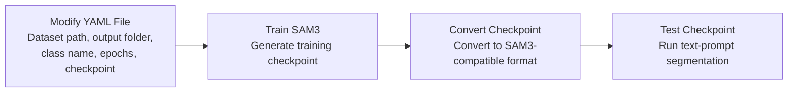

# SAM3 Fine-tuning Workflow in WSL

This guide describes a simple workflow for fine-tuning SAM3 with a custom COCO-like dataset in a WSL environment.

The overall pipeline is:

```text
Modify YAML Configuration
→ Train SAM3 Model
→ Convert Checkpoint Format
→ Test Converted Checkpoint
```

---

## Workflow Diagram


A more detailed version:



---

## 1. Prepare the Dataset

The dataset should follow a COCO-like structure:

```text
your_path/NMC_particle_dataset
├── train
│   ├── images
│   └── annotations.json
└── val
    ├── images
    └── annotations.json
```

The `annotations.json` file should contain the required COCO-like fields, including image information, annotations, categories, segmentation masks, bounding boxes, and `noun_phrase`.

For example, if the target object is `particle`, the annotation should contain:

```json
"noun_phrase": "particle"
```

It is recommended to keep the target class name consistent across the dataset, YAML file, and testing script.

---

## 2. Modify the YAML Configuration File

Open the YAML configuration file:

```text
your_path/sam3/sam3/train/configs/roboflow_v100/roboflow_v100_full_ft_100_images.yaml
```

The main parameters that usually need to be modified are listed below.

---

### 2.1 Dataset Root Path

Modify the dataset root path:

```yaml
roboflow_vl_100_root: your_path/NMC_particle_dataset
```

This directory should contain:

```text
train/images
train/annotations.json
val/images
val/annotations.json
```

---

### 2.2 Experiment Output Directory

Modify the experiment log directory:

```yaml
experiment_log_dir: your_path/experiments/nmc_particle_sam3_test_001
```

Training logs and checkpoints will be saved in this folder.

It is recommended to use a new output directory for each experiment, for example:

```text
your_path/experiments/nmc_particle_sam3_epoch20_001
your_path/experiments/nmc_particle_sam3_epoch20_002
your_path/experiments/nmc_particle_sam3_epoch50_001
```

This makes it easier to compare different training results.

---

### 2.3 Target Class Name

Modify the target class name:

```yaml
supercategory: particle
```

The `supercategory` should be consistent with the `noun_phrase` field in `annotations.json`.

For example, if the annotation file contains:

```json
"noun_phrase": "particle"
```

Then the text prompt used for testing should also be:

```text
particle
```

Keeping the class name consistent is important for stable fine-tuning and testing.

---

### 2.4 Number of Training Epochs

Modify the number of training epochs:

```yaml
max_epochs: 20
```

Recommended settings:

```text
1–5 epochs: quick test to check whether the training pipeline works
10–20 epochs: initial fine-tuning test
50–100 epochs: formal training after the dataset is verified
100+ epochs: only recommended when the dataset is large enough and the model is still improving
```

It is not recommended to start directly with a very large number of epochs, such as 2000, because this may lead to overfitting and unnecessary training time.

---

### 2.5 Initial Checkpoint Path

Modify the checkpoint path.

If fine-tuning from the original SAM3 checkpoint:

```yaml
checkpoint_path: your_path/sam3/sam3.pt
```

If continuing training from a previous fine-tuned checkpoint:

```yaml
checkpoint_path: your_path/experiments/nmc_particle_sam3_test_001/checkpoints/checkpoint.pt
```

---

## 3. Start Training

Run the training command in WSL:

```bash
cd your_path/sam3

python sam3/train/train.py \
  -c sam3/train/configs/roboflow_v100/roboflow_v100_full_ft_100_images.yaml \
  --use-cluster 0 \
  --num-gpus 1
```

After training, the output checkpoint is usually saved under the experiment folder, for example:

```text
your_path/experiments/nmc_particle_sam3_test_001/checkpoints/checkpoint.pt
```

---

## 4. Convert the Checkpoint Format

After training, the checkpoint may need to be converted into a SAM3-compatible format for testing or inference.

Run:

```bash
cd your_path/sam3

python convert_my_checkpoint_to_sam3_format.py
```

Before running the script, check the paths inside `convert_my_checkpoint_to_sam3_format.py`.

Example paths:

```python
input_checkpoint = "your_path/experiments/nmc_particle_sam3_test_001/checkpoints/checkpoint.pt"

base_checkpoint = "your_path/sam3/sam3.pt"

output_checkpoint = "your_path/experiments/nmc_particle_sam3_test_001/converted_sam3_checkpoint.pt"
```

The logic is:

```text
training checkpoint.pt
→ convert_my_checkpoint_to_sam3_format.py
→ converted_sam3_checkpoint.pt
```

---

## 5. Test the Converted Checkpoint

After converting the checkpoint, test whether the model can be loaded and used for text-prompt segmentation.

Run:

```bash
cd your_path/sam3

python test_converted_sam3_checkpoint_v2.py
```

Before running the script, check the paths inside `test_converted_sam3_checkpoint_v2.py`.

Example paths:

```python
checkpoint_path = "your_path/experiments/nmc_particle_sam3_test_001/converted_sam3_checkpoint.pt"

image_path = "your_path/NMC_particle_dataset/val/images/example.png"

text_prompt = "particle"

output_dir = "your_path/test_outputs/nmc_particle_sam3_test_001"
```

The test script should check:

```text
1. Whether the converted checkpoint can be loaded successfully
2. Whether the text prompt can detect the target object
3. Whether the predicted masks are saved correctly
```

---

## 6. Important Notes

### 6.1 Use Linux Paths Inside WSL

When running commands inside WSL, use Linux-style paths:

```text
your_path/...
```

For example:

```text
your_path/sam3
your_path/NMC_particle_dataset
your_path/experiments
```

Avoid using Windows-style paths inside WSL scripts, such as:

```text
\\wsl.localhost\Ubuntu-24.04\...
```

or:

```text
D:\...
```

These paths are useful for accessing files from Windows Explorer, but they may cause errors inside WSL Python scripts or YAML files.

---

### 6.2 Keep the Class Name Consistent

The following names should be consistent:

```text
supercategory in YAML
category name in annotations.json
noun_phrase in annotations.json
text prompt used during testing
```

For example, if the target is `particle`, use:

```text
particle
```

consistently everywhere.

---

### 6.3 Do Not Mix Raw and Converted Checkpoints

The training output checkpoint is usually:

```text
checkpoint.pt
```

The converted checkpoint is usually:

```text
converted_sam3_checkpoint.pt
```

For testing and inference, use the converted checkpoint:

```text
your_path/experiments/nmc_particle_sam3_test_001/converted_sam3_checkpoint.pt
```

---

## 7. Summary

The recommended workflow is:

```text
1. Prepare the COCO-like dataset
2. Modify the YAML configuration file
3. Train SAM3 in WSL
4. Convert the training checkpoint to SAM3 format
5. Test the converted checkpoint with a text prompt
6. Save and inspect the predicted masks
```

A typical workflow is:

```text
Dataset
→ YAML configuration
→ Training
→ checkpoint.pt
→ Checkpoint conversion
→ converted_sam3_checkpoint.pt
→ Text-prompt testing
→ Saved masks
```
